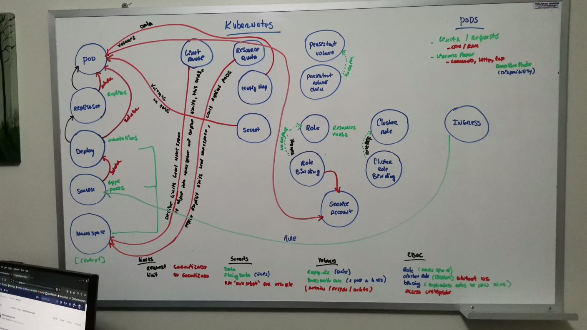
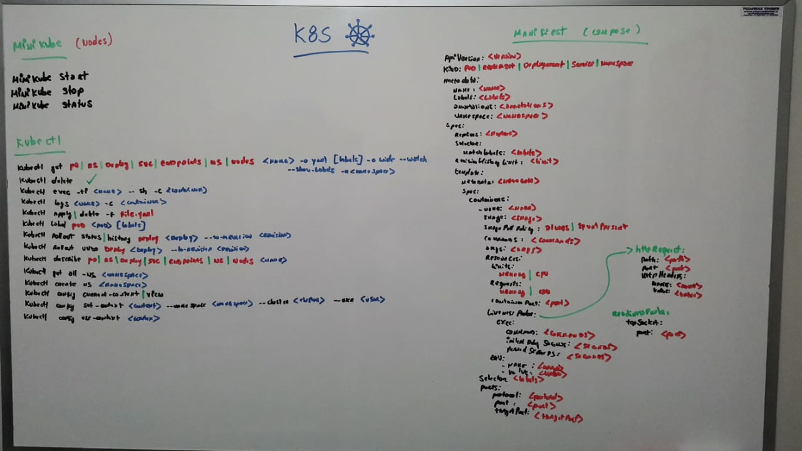
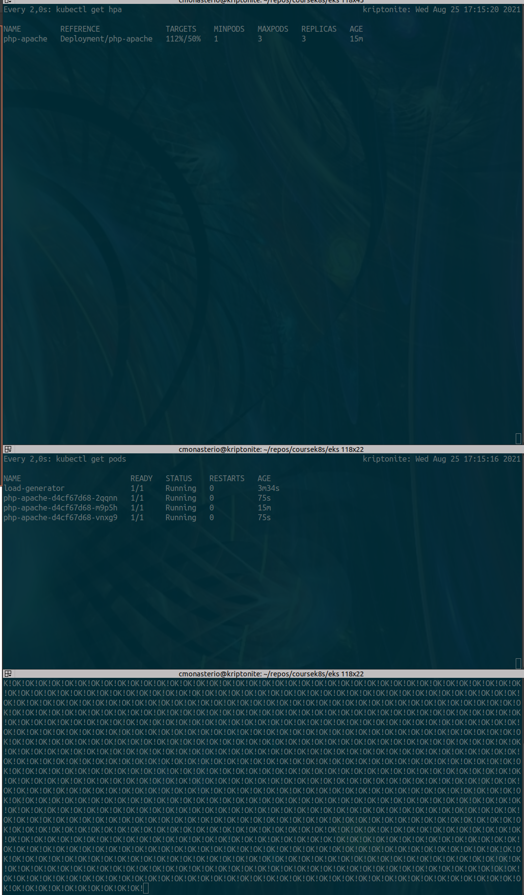

https://computingforgeeks.com/deploy-kubernetes-cluster-on-ubuntu-with-kubeadm/


# Install Kubernetes
```bash
apt-get update
apt-get upgrade -y
apt install docker.io -y
systemctl start docker
systemctl enable docker
docker --version
reboot

apt install apt-transport-https curl
curl -s https://packages.cloud.google.com/apt/doc/apt-key.gpg | sudo apt-key add
apt-add-repository "deb http://apt.kubernetes.io/ kubernetes-xenial main"
apt install kubeadm kubelet kubectl kubernetes-cni

swapoff -a
reboot

hostnamectl set-hostname kubernetes-master
hostnamectl set-hostname kubernetes-worker
kubeadm init
mkdir -p $HOME/.kube
cp -i /etc/kubernetes/admin.conf $HOME/.kube/config
chown $(id -u):$(id -g) $HOME/.kube/config
kubectl get pods --all-namespaces

wget https://storage.googleapis.com/minikube/releases/latest/minikube-linux-amd64
chmod +x minikube-linux-amd64
mv minikube-linux-amd64 /usr/local/bin/minikube
```

# Commands for Cluster in Minikube
```bash
minikube status
minikube start --driver=none
kubectl run --generator=run-pod/v1 podtest --image=nginx:alpine
```

# Commands for Pods
```bash
kubectl get pods #kubectl get po
kubectl api-resources
kubectl delete pod podtest1
kubectl get pod podtest
kubectl get pod podtest -o yaml
kubectl describe pod podtest
kubectl exec -ti  podtest -- sh
kubectl logs  podtest
kubectl apply -f pod.yaml
kubectl delete -f pod.yaml
kubectl logs twocons -c cont1
kubectl logs twocons -c cont2
kubectl exec -ti twocons -c cont1 -- sh
kubectl exec -ti twocons -c cont2 -- sh
kubectl get pods -l app=backend
kubectl get pods -l app=front
kubectl get pods -l env=dev
kubectl get pods -l app=front -o wide #show more information
kubectl get pods --watch

#delete older pods force 
kubectl delete pod podtest1 --grace-period=0 --force
```
# Commands for Replicasets
```bash
kubectl get pods -l app=pod-label
kubectl get replicaset #kubectl get rs
kubectl describe replicaset replicaset-set
kubectl label pods podtest1 app=pod-label
kubectl apply -f replicaset.yaml
```

# Commands for Deployment
```bash
kubectl get deployment #kubectl get deploy
kubectl get deployment --show-labels
kubectl get deployment -l app=front
kubectl get deployments
kubectl apply -f deployment.yaml
kubectl apply -f deployment.yaml --record #coment in change-cause in rollout history
kubectl describe deployment deployment-test
kubectl rollout status deployment deployment-test
kubectl rollout history deployment deployment-test
kubectl rollout history deployment deployment-test --revision 3
kubectl rollout undo deployment deployment-test --to-revision 2

#restart all pod of deployment
kubectl rollout restart deployment deployment-test
```

# Commands for Services
```bash
kubectl apply -f service.yaml
kubectl get service #kubectl get svc
kubectl get svc -o wide
kubectl get svc -l app=front
kubectl describe svc my-service
curl my-service:8080 #into container
curl locahost::32188 #access pod by nodeport service
```

# Commands for EndPoints
```bash
kubectl get endpoints
kubectl get endpoints -l app=front
```

# Commands for Namespaces
```bash
kubectl get namespaces
kubectl get pods --namespace default
kubectl get all -n kube-public
kubectl create namespace test-ns
kubectl describe ns test-ns
kubectl get ns --show-labels
kubectl run --generator=run-pod/v1 podtest4 --image=nginx:alpine --namespace test-ns
kubectl get po -n test-ns
kubectl delete po podtest4 -n test-ns
kubectl get deploy -n dev
curl namesvc.namesns.svc.cluster.local #ping or curl other namespaces
kubectl config current-context
kubectl config view
kubectl config set-context ci-context --namespace ci --cluster minikube --user minikube
kubectl config use-context ci-context
kubectl config use-context minikube
```

# Commands for Nodes
```bash
kubectl get nodes
kubectl describe node kubernetes-worker
```

# Commands for Limit Range
```bash
kubectl get limitrange
kubectl get limitrange -n dev
kubectl describe limitrange men-cpu-limit-range -n dev
```

# Commands for Resource Quota
```bash
kubectl get resourcequotas -n uat
kubectl describe resourcequota res-quota -n uat
```

# Commands for Config Maps
```bash
kubectl create configmap nginx-config --from-file /opt/coursek8s/config-map/examples/nginx.conf
kubectl get cm
kubectl describe cm nginx-config
kubectl create configmap nginx-config-dir --from-file /opt/coursek8s/config-map/examples
```

# Commands for Secret
```bash
kubectl create secret generic mysecret --from-file secrets-files/test.txt
kubectl get secret
kubectl describe secret mysecret
kubectl get secret mysecret -o yaml
#example enconding
echo "hello" | base64
echo "aGVsbG8K" | base64 --decode
#----
kubectl delete secret mysecret
#example secrets with variables
export USER=cristhian
export PASSWORD=cristhian
echo $USER
echo $PASSWORD
#replace variables to text from local
envsubst < secret-secure.yaml > tmp.yaml
#---
kubectl apply -f tmp.yaml
```

# Commands for Volumes
```bash
kubectl get pv
kubectl describe pv task-pv-volume
kubectl get pvc -o wide
kubectl describe pvc task-pv-claim
kubectl get storageclass #kubectl get sc
kubectl edit pv test-pv

#change PV to Retain
kubectl  patch pv test-pv -p "{\"spec\":{\"persistentVolumeReclaimPolicy\":\"Retain\"}}"
```

# Commands for RBAC
```bash
## Create keys and sign
openssl genrsa -out cristhian.key 2048
openssl req -new -key cristhian.key -out cristhian.csr -subj "/CN=cristhian/O=dev"
sudo openssl x509 -req -in cristhian.csr -CA /root/.minikube/ca.crt -CAkey /root/.minikube/ca.key -CAcreateserial -out cristhian.crt -days 500
openssl x509 -in  cristhian.crt  -noout -text

## Isolated env
kubectl config view  | grep server
kubectl cluster-info
docker run --rm -ti -v $PWD:/test -w /test  -v /root/.minikube/ca.crt:/ca.crt -v /usr/bin/kubectl:/usr/bin/kubectl alpine sh

## Configure kubectl for user
kubectl config set-cluster minikube --server=https://161.35.126.109:8443 --certificate-authority=/ca.crt
kubectl config set-credentials cristhian --client-certificate=cristhian.crt --client-key=cristhian.key
kubectl config set-context cristhian --cluster=minikube --user=cristhian
kubectl config use-context cristhian

## Verificate# RBAC
kubectl cluster-info dump
kubectl cluster-info dump | grep authorization-mode
minikube start --vm-driver=none  --extra-config=apiserver.authorization-mode=RBAC #in case RBAC is not enabled

kubectl config get-contexts
kubectl config use-context cristhian

#roles
kubectl get role
kubectl describe role pod-reader
kubectl get rolebinding
kubectl describe rolebinding read-pods
kubectl get clusterroles
```

# Commands for Service Account
```bash
kubectl get serviceaccount #kubectl get sa
kubectl describe sa default
kubectl get secret
kubectl get secret default-token-bcltj -o yaml
curl https://10.96.0.1/api/v1/namespaces/default/pods --insecure
TOKEN=$(cat /var/run/secrets/kubernetes.io/serviceaccount/token)
curl -H "Authorization: Bearer ${TOKEN}" https://10.96.0.1/api/v1 --insecure
curl -H "Authorization: Bearer ${TOKEN}" https://10.96.0.1/api/v1/namespaces/default/pods --insecure
curl -H "Authorization: Bearer ${TOKEN}" https://10.96.0.1/apis/apps/v1/namespaces/default/deployments --insecure
curl -H "Authorization: Bearer ${TOKEN}" https://10.96.0.1/apis/apps/v1/namespaces/default/replicasets --insecure
```
# Commands for Ingress
```bash
kubectl apply -f https://raw.githubusercontent.com/kubernetes/ingress-nginx/controller-v0.45.0/deploy/static/provider/baremetal/deploy.yaml
kubectl get svc -n ingress-nginx
minikube service ingress-nginx-controller -n ingress-nginx --url
curl http://161.35.126.109:30300/appv1

echo "161.35.126.109 app1.mydomain.com" >> /etc/hosts
curl app1.mydomain.com:30300
curl http://localhost:30300/test
echo "161.35.126.109 app2.mydomain.com" >> /etc/hosts
curl app2.mydomain.com:30300

echo "161.35.126.109 entry1.mydomain.com" >> /etc/hosts
echo "161.35.126.109 entry2.mydomain.com" >> /etc/hosts
curl entry1.mydomain.com:30300/app1
curl entry1.mydomain.com:30300/app2
curl entry2.mydomain.com:30300/service1
curl entry2.mydomain.com:30300/service2
```

# Commands for API
```bash
kubectl api-versions
kubectl api-resources | grep Pod
```

# Commands for Docker
```bash
docker ps -l #latest docker create
docker run --net host  -ti python:3.6-alpine sh
```

# Commands for AWS

## Commands for install EKS
```bash
########################### Step 0 ###########################
#install AWS CLI
pip3 install -U awscli
aws --version
aws configure
ls ~/.aws
aws sts get-caller-identity

#install Elastic Kubernetes Services
curl --silent --location "https://github.com/weaveworks/eksctl/releases/latest/download/eksctl_$(uname -s)_amd64.tar.gz" | tar xz -C /tmp
sudo chmod +x /usr/local/bin/eksctl
eksctl version
```
## Commands for configurate EKS
```bash
########################### Step 1 ###########################
#eksctl create cluster (master)
eksctl create cluster \
--name test-cluster \
--region us-east-2 \
--zones us-east-2a,us-east-2b \
--without-nodegroup

#view configuration
cat ~/.kube/config

#uodated configuration cluster from EKS, to crate new file to connecto to cluster
#aws eks --region us-east-2 update-kubeconfig --name my-cluster

#view Cloud Formation and EKS
kubectl cluster-info

########################### Step 2 ###########################
#create node
eksctl create nodegroup \
--cluster test-cluster \
--name test-workers \
--node-type t3.medium \
--region us-east-2 \
--nodes 1 \
--nodes-min 1 \
--nodes-max 3 \
--asg-access #enable IAM policy cluster-autoscaler

#view in Cloud Formation and EC2
kubectl get nodes
kubectl describe nodes ip-192-168-15-79.us-east-2.compute.internal
```
## Commands for configurate ALB Ingress Controller
```bash
########################### Step 3 ###########################
#create IAM for Ingress ALB
eksctl utils associate-iam-oidc-provider \
--region us-east-2 \
--cluster test-cluster \
--approve

#create policy for Ingress ALB
aws iam create-policy \
--policy-name ALBIngressControllerIAMPolicy \
--policy-document https://raw.githubusercontent.com/kubernetes-sigs/aws-alb-ingress-controller/v1.1.4/docs/examples/iam-policy.json

#ALB Ingress
kubectl apply -f https://raw.githubusercontent.com/kubernetes-sigs/aws-alb-ingress-controller/v1.1.4/docs/examples/rbac-role.yaml

#attach IAM policy to ALB ingress
eksctl create iamserviceaccount \
--region us-east-2 \
--name alb-ingress-controller \
--namespace kube-system \
--cluster test-cluster \
--attach-policy-arn arn:aws:iam::805933498179:policy/ALBIngressControllerIAMPolicy \
--override-existing-serviceaccounts \
--approve

#create ingress controller
kubectl apply -f https://raw.githubusercontent.com/kubernetes-sigs/aws-alb-ingress-controller/v1.1.4/docs/examples/alb-ingress-controller.yaml

kubectl edit deployment.apps/alb-ingress-controller -n kube-system
#add - --cluster-name=test-cluster bellow - --ingress-class=alb in section containers
#checking change in pods
kubectl get pods -n kube-system
kubectl describe po alb-ingress-controller-5b9d9468c-cbgm4 -n kube-system
```

## Commands ALB Ingress EKS
```bash
#check 2048 example AWS EKS
kubectl apply -f https://raw.githubusercontent.com/kubernetes-sigs/aws-alb-ingress-controller/v1.1.4/docs/examples/2048/2048-namespace.yaml

kubectl apply -f https://raw.githubusercontent.com/kubernetes-sigs/aws-alb-ingress-controller/v1.1.4/docs/examples/2048/2048-deployment.yaml

kubectl apply -f https://raw.githubusercontent.com/kubernetes-sigs/aws-alb-ingress-controller/v1.1.4/docs/examples/2048/2048-service.yaml

kubectl get all -n 2048-game

#tunnel from pod to localhost
kubectl port-forward pod/2048-deployment-576b7577d9-9qpxl 7000:80 -n 2048-game
#view in http://127.0.0.1:7000/

#kubectl apply -f https://raw.githubusercontent.com/kubernetes-sigs/aws-alb-ingress-controller/v1.1.4/docs/examples/2048/2048-ingress.yaml

kubectl get ingress -n 2048-game

#view log ingress
kubectl logs -f alb-ingress-controller-5b9d9468c-cbgm4 -n kube-system
```

## Commands Horizontal Pod AutoScaler EKS

```bash
#https://docs.aws.amazon.com/eks/latest/userguide/horizontal-pod-autoscaler.html
kubectl apply -f https://github.com/kubernetes-sigs/metrics-server/releases/download/v0.3.6/components.yaml
kubectl get deployment metrics-server -n kube-system
kubectl apply -f https://k8s.io/examples/application/php-apache.yaml

#create auto pod scaler
kubectl autoscale deployment php-apache --cpu-percent=50 --min=1 --max=10
kubectl describe hpa php-apache

#to stress for uses auto scaler
kubectl run -it --rm load-generator --image=busybox /bin/sh --generator=run-pod/v1

#into new pod created execute next Commands
while true; do wget -q -O- http://php-apache; done
```

## Commands Horizontal Pod AutoScaler EKS

```bash
#policy to can autoscaler, EKS to created
#aws iam create-policy \
#    --policy-name AmazonEKSClusterAutoscalerPolicy \
#    --policy-document file://cluster-autoscaler-policy.json

#eksctl create iamserviceaccount \
#      --cluster=test-cluster \
#      --namespace=kube-system \
#      --name=cluster-autoscaler \
#      --attach-policy-arn arn:aws:iam::805933498179:policy/AmazonEKSClusterAutoscalerPolicy \
#      --override-existing-serviceaccounts \
#      --approve

kubectl apply -f https://raw.githubusercontent.com/kubernetes/autoscaler/master/cluster-autoscaler/cloudprovider/aws/examples/cluster-autoscaler-autodiscover.yaml

kubectl get deploy cluster-autoscaler -n kube-system

kubectl -n kube-system edit deploy cluster-autoscaler
#add this the final spec->containers->command
#replace <YOUR CLUSTER NAME> whith the real name, in this case is "test-cluster"
#- --balance-similar-node-groups
#- --skip-nodes-with-system-pods=false

kubectl get pods -A #view nodes of all namespaces

#view log auto clusterscale
kubectl logs cluster-autoscaler-684f7b5b6d-2w9l7 -n kube-system
#view increment nodes
kubectl get nodes #max nodes depends of how to create cluster with nodes, in this case is 3 as maximum
#view autoscaling group in https://us-east-2.console.aws.amazon.com/ec2autoscaling/home?region=us-east-2#/
#view increment intances in https://us-east-2.console.aws.amazon.com/ec2/v2/home?region=us-east-2#Instances:
```
## Get Config from EKS Cluster

```bash
aws eks update-kubeconfig --name cluster_name
```

# Kustomize

```bash
#install
sudo snap install kustomize
kustomize version

#execute simple build
kustomize build .

#execute build with extensions, for example sops
kubectl kustomize --enable-alpha-plugins

#execute build for helm
kubectl kustomize --enable-helm
kubectl kustomize --enable-helm --enable-alpha-plugins

#for ksops
#add path XDG_CONFIG_HOME in User Home, after run
source /etc/environment
source <(curl -s https://raw.githubusercontent.com/viaduct-ai/kustomize-sops/master/scripts/install-ksops-archive.sh)
```

# Jobs

```bash
#https://devopscube.com/create-kubernetes-jobs-cron-jobs/
docker build -t kubernetes-job-demo .
docker tag kubernetes-job-demo mt2h/kubernetes-job-demo:latest
docker push mt2h/kubernetes-job-demo:latest
kubectl apply -f job.yaml
kubectl get jobs
kubectl get po
kubectl logs kubernetes-job-example--1-qtc7z -f

kubectl apply -f parallel-job.yaml
kubectl get job --watch
kubectl get po --watch

kubectl create -f job-gen-name.yaml
```

# CronJobs

```bash
#https://devopscube.com/create-kubernetes-jobs-cron-jobs/
#https://crontab-generator.org/
kubectl create -f cron-job.yaml
kubectl get cronjobs
kubectl describe cronjob kubernetes-cron-job
kubectl get pods --watch

#run a cronjob manually by pod
kubectl create job --from=cronjob/kubernetes-cron-job manual-cron-job

#suspend cronjob
kubectl patch cronjobs kubernetes-cron-job -p "{\"spec\" : {\"suspend\" : true }}"
```

# Kubetail

```bash
#install
sudo apt-get -y install kubetail

#get logs all containers "container1"
kubetail -n test -c "container1" -l "app=web"
```

# Board Structure


# Board Commands



